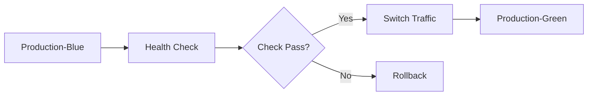

# Freelancing Masterclass (Cohort 1) 🚀

## Overview
This document provides a comprehensive list of notable talent networks and platforms for freelancers. Each platform offers unique features and caters to different skill sets and industries.

## Talent Networks and Platforms

### 1. Nova
**Nova** is an exclusive network for the top 3% of global talent, with over 20,000 members selected based on merit. It offers curated introductions, interest-based groups, and exclusive events.

### 2. Toptal
**Toptal** is a network of the top 3% of freelance software developers, designers, finance experts, product managers, and project managers. It offers a rigorous vetting process and flexible engagements.

### 3. Upwork
**Upwork** is a large freelancing platform serving companies from startups to Fortune 100 firms. It offers over 8,000 skills across various categories.

### 4. Freelancer.com
**Freelancer.com** claims to be the world's largest freelancing and crowdsourcing marketplace, with millions of registered users and projects posted.

### 5. Fiverr
**Fiverr** is an online creative marketplace connecting businesses with freelance talent offering digital services in over 400 categories.

### 6. Indeed
**Indeed** is a large job site with millions of job listings and company reviews.

### 7. Guru.com
**Guru.com** is a platform where professionals connect and collaborate in a virtual environment.

### 8. Braintrust
**Braintrust** is a talent network that uses AI for recruiting and matching. It offers lower fees compared to traditional agencies.

### 9. FlexTal
**FlexTal** provides personalized talent matching within 7-10 days and offers flexible engagement options.

### 10. Maturious
**Maturious** uses objective employment biodata analysis and evaluation tools to match mature-age candidates.

### 11. Scismic
**Scismic** is a talent matching platform specifically for scientists.

### 12. Bullseye Engagement
**Bullseye Engagement** offers tools to match candidates based on customized criteria and build project teams.

### 13. Blonk
**Blonk** uses AI-based matching to connect employers with talent globally.

### 14. Talent Match Global
**Talent Match Global** uses advanced algorithms to connect talent with career opportunities.

### 15. Wellfound (formerly AngelList Talent)
**Wellfound** is a platform focused on startup talent, with over 8 million candidates and free job postings.

### 16. Hired
**Hired** focuses on tech and sales professionals, offering a personalized approach to job matching.

### 17. ZipRecruiter
**ZipRecruiter** offers job posting distribution to multiple boards and social media channels, with automated screening tools.

### 18. Glassdoor
**Glassdoor** provides company information and job opportunities, along with employer branding tools.

### 19. CareerBuilder
**CareerBuilder** offers job postings, resume searches, and analytics to help employers make informed hiring decisions.

### 20. iMocha
**iMocha** is a talent assessment and matching platform that uses AI-enabled skills intelligence.

## Summary Table

| Platform            | Description                                                                 |
|---------------------|-----------------------------------------------------------------------------|
| Nova                | Exclusive network for top 3% of global talent                                |
| Toptal              | Network of top 3% of freelance professionals                                 |
| Upwork              | Large freelancing platform with over 8,000 skills                            |
| Freelancer.com      | World's largest freelancing and crowdsourcing marketplace                    |
| Fiverr              | Online creative marketplace with over 400 categories                         |
| Indeed              | Large job site with millions of job listings                                 |
| Guru.com            | Platform for professionals to connect and collaborate                        |
| Braintrust          | AI-based talent network with lower fees                                      |
| FlexTal             | Personalized talent matching within 7-10 days                                |
| Maturious           | Matches mature-age candidates using objective biodata analysis               |
| Scismic             | Talent matching platform for scientists                                      |
| Bullseye Engagement | Tools to match candidates based on customized criteria                       |
| Blonk               | AI-based matching to connect employers with talent globally                  |
| Talent Match Global | Advanced algorithms to connect talent with career opportunities              |
| Wellfound           | Platform focused on startup talent with over 8 million candidates            |
| Hired               | Personalized job matching for tech and sales professionals                   |
| ZipRecruiter        | Job posting distribution to multiple boards and social media channels        |
| Glassdoor           | Company information and job opportunities with employer branding tools       |
| CareerBuilder       | Job postings, resume searches, and analytics for informed hiring decisions   |
| iMocha              | Talent assessment and matching platform using AI-enabled skills intelligence |

## Citations
1. [Crowdsourcing Week](https://crowdsourcingweek.com/blog/top-10-freelancing-platforms/)
2. [Nova Talent](https://www.novatalent.com)
3. [Vantage Circle](https://www.vantagecircle.com/en/blog/best-talent-management-system/)
4. [Nectar Desk](https://www.nectardesk.com/top-10-recruitment-networks/)
5. [Pearl Talent](https://www.pearltalent.com/resources/hiring-platform-for-startups)
6. [Consider Blog](https://blog.consider.com/posts/a-few-recently-launched-vc-talent-platforms)
7. [iMocha Blog](https://blog.imocha.io/talent-matching-platforms)
8. [Braintrust](https://www.usebraintrust.com)

# Building a Robust Fitness Tracking Backend: Technical Architecture Guide 🏗️

## Overview 🎯
Let's dive into creating a comprehensive backend architecture for a fitness tracking application, incorporating best practices and modern development approaches.

## Core Architecture Components 🔧

### 1. User Authentication & Authorization System 🔐
```typescript
// Authentication middleware example
const authMiddleware = async (req: Request, res: Response, next: NextFunction) => {
  try {
    const token = req.headers.authorization?.split(' ')[1];
    if (!token) throw new Error('No token provided');
    
    const decoded = jwt.verify(token, process.env.JWT_SECRET);
    req.user = decoded;
    next();
  } catch (error) {
    res.status(401).json({ error: 'Authentication failed' });
  }
};
```

### 2. Database Schema Design 📊

```sql
-- Core tables structure
CREATE TABLE users (
    user_id UUID PRIMARY KEY,
    email VARCHAR(255) UNIQUE NOT NULL,
    password_hash TEXT NOT NULL,
    created_at TIMESTAMP DEFAULT CURRENT_TIMESTAMP
);

CREATE TABLE workouts (
    workout_id UUID PRIMARY KEY,
    user_id UUID REFERENCES users(user_id),
    type VARCHAR(50) NOT NULL,
    duration_minutes INTEGER NOT NULL,
    calories_burned INTEGER,
    timestamp TIMESTAMP DEFAULT CURRENT_TIMESTAMP
);
```

## API Endpoints Structure 🛣️

| Endpoint | Method | Purpose | Status Codes |
|----------|---------|---------|--------------|
| `/api/auth/register` | POST | User registration | 201, 400 |
| `/api/auth/login` | POST | User authentication | 200, 401 |
| `/api/workouts` | GET | Fetch user workouts | 200, 404 |
| `/api/workouts` | POST | Log new workout | 201, 400 |

## Edge Case Handling Strategy 🛡️

### Input Validation
```javascript
const validateWorkout = (data) => {
  const errors = [];
  
  if (!data.duration || data.duration <= 0) {
    errors.push('Duration must be positive');
  }
  
  if (!['cardio', 'strength', 'flexibility'].includes(data.type)) {
    errors.push('Invalid workout type');
  }
  
  return errors;
};
```

## Deployment Architecture 🚀

### Blue-Green Deployment Flow


## Database Selection Guide 💾

### Recommended Stack
- **Primary DB**: PostgreSQL
  - *Reason*: ACID compliance, complex query support
- **Cache Layer**: Redis
  - *Reason*: Fast retrieval of frequently accessed data
- **Search Engine**: Elasticsearch
  - *Reason*: Advanced workout search capabilities

## Performance Monitoring 📈

```javascript
// Performance middleware
const performanceMiddleware = async (req, res, next) => {
  const start = process.hrtime();
  
  res.on('finish', () => {
    const [seconds, nanoseconds] = process.hrtime(start);
    const duration = seconds * 1000 + nanoseconds / 1000000;
    
    console.log(`${req.method} ${req.url} - ${duration}ms`);
  });
  
  next();
};
```

## Error Handling Strategy 🔍

### HTTP Status Code Implementation
```typescript
enum HttpStatus {
  OK = 200,
  CREATED = 201,
  BAD_REQUEST = 400,
  UNAUTHORIZED = 401,
  NOT_FOUND = 404,
  INTERNAL_ERROR = 500
}

class ApiResponse {
  static success(data: any) {
    return {
      status: HttpStatus.OK,
      data,
      error: null
    };
  }
  
  static error(status: HttpStatus, message: string) {
    return {
      status,
      data: null,
      error: message
    };
  }
}
```
