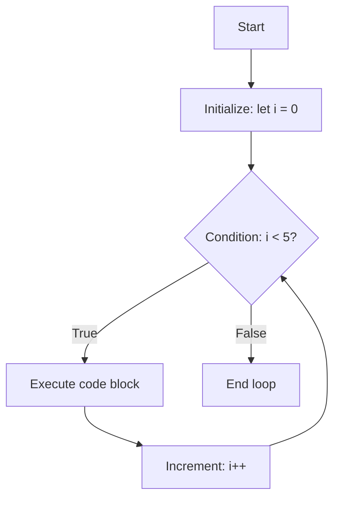
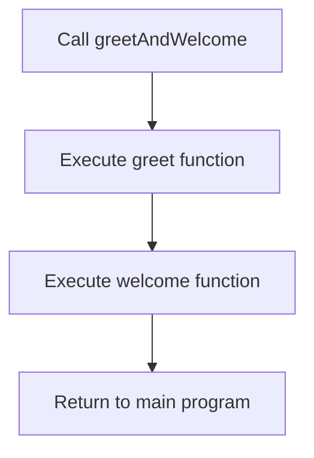

# JavaScript: Loops, Functions & Callbacks 🚀

## 1. Loops in JavaScript 🔄

A `for` loop is a control flow statement that allows you to repeatedly execute a block of code a certain number of times or iterate over elements in an array or other iterable objects.

### Anatomy of a `for` Loop 📊

```javascript
for (initialization; condition; increment/decrement) {
  // code to be executed
}
```

### Key Components 🔍

| Component | Purpose | Example |
|-----------|---------|---------|
| **Initialization** | Sets up counter variable | `let i = 0;` |
| **Condition** | Evaluated before each iteration | `i < 5` |
| **Increment/Decrement** | Changes counter after each iteration | `i++` or `i--` |
| **Code Block** | Statements executed repeatedly | `console.log(i);` |

### Visual Flow 📈



### Example 💻

```javascript
for (let i = 0; i < 5; i++) {
  console.log(i);
}
// Output:
// 0
// 1
// 2
// 3
// 4
```

> 💡 **Visualization Tool**: See loops in action at [Loupe](http://latentflip.com/loupe/)

## 2. Functions in JavaScript 📦

### What is a function? 🤔

A function in JavaScript is a set of statements that performs a task or calculates a value. It should take some input and return an output where there is some obvious relationship between the input and the output.

### Function Types & Syntax 📝

| Function Type | Syntax | Example |
|---------------|--------|---------|
| **Function Declaration** | `function name() {}` | `function greet() { console.log("Hello!"); }` |
| **Function Expression** | `const name = function() {}` | `const multiply = function(x, y) { return x * y; };` |
| **Arrow Function** | `const name = () => {}` | `const square = (x) => x * x;` |

### Function Components 🧩

#### Function Declaration:

```javascript
function greet() {
  console.log("Hello, world!");
}
```

#### Parameters and Arguments:

```javascript
function greetPerson(name) {
  console.log(`Hello, ${name}!`);
}

greetPerson("Alice"); // Output: Hello, Alice!
```

> 🔹 **Parameter**: `name` is the variable in the function definition
> 
> 🔹 **Argument**: `"Alice"` is the value passed when calling the function

#### Return Statement:

```javascript
function add(a, b) {
  return a + b;
}

const result = add(3, 5);
console.log(result); // Output: 8
```

#### Arrow Functions (ES6+):

```javascript
const square = (x) => x * x;
```

### Key Function Concepts 🔑

- **Higher-Order Functions**: Functions that accept other functions as arguments or return functions
- **Scope**: Variables declared inside a function are typically only accessible within that function
- **Closures**: Functions retain access to variables from their containing scope

## 3. Callback Functions 📞

### Understanding Callbacks 🧠

Can you call one function inside another function? **Yes!** 

> 💡 A callback is simply a function passed into another function as an argument, which is then invoked inside the outer function.

### Example of Nested Function Calls 🔄

```javascript
function greet(name) {
  console.log(`Hello, ${name}!`);
}

function welcome() {
  console.log("Welcome to our website!");
}

function greetAndWelcome(userName) {
  greet(userName); // Calling the greet function inside greetAndWelcome
  welcome(); // Calling the welcome function inside greetAndWelcome
}

// Calling the greetAndWelcome function
greetAndWelcome("Alice");
```

### Callback Flow Visualization 📊



### Benefits of Callbacks 🌟

- **Code Organization**: Break complex tasks into smaller, manageable parts
- **Reusability**: Functions can be reused across different contexts
- **Flexibility**: Creates dynamic behavior by passing different functions

## JavaScript Programming Concepts: Quick Reference 📑

| Concept | Description | Common Use Cases |
|---------|-------------|------------------|
| **Loops** | Control flow for repetitive tasks | Array iteration, repetitive tasks |
| **Functions** | Reusable blocks of code | Code organization, reusability |
| **Callbacks** | Functions passed as arguments | Event handling, asynchronous operations |

> 🚀 **Pro Tip**: When writing JavaScript code, focus on creating small, single-purpose functions that can be combined to solve complex problems!
