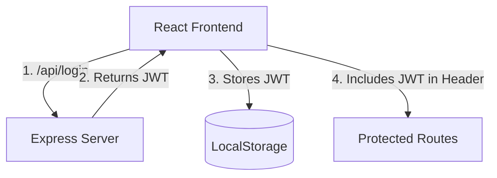
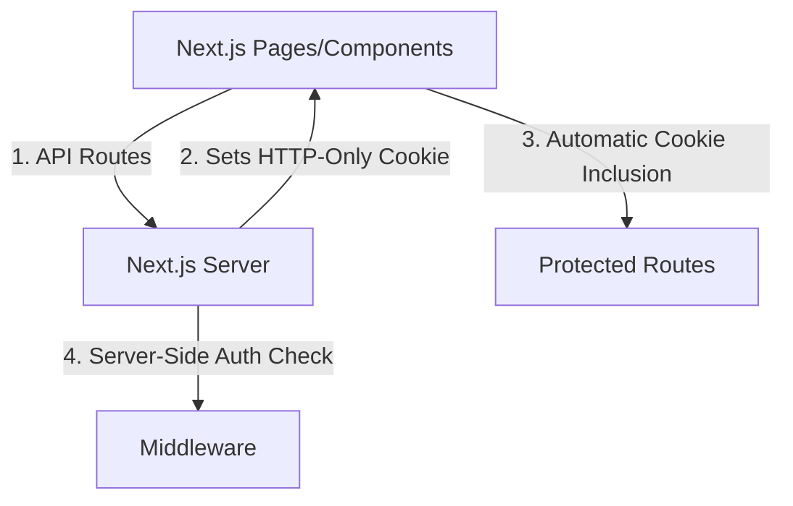
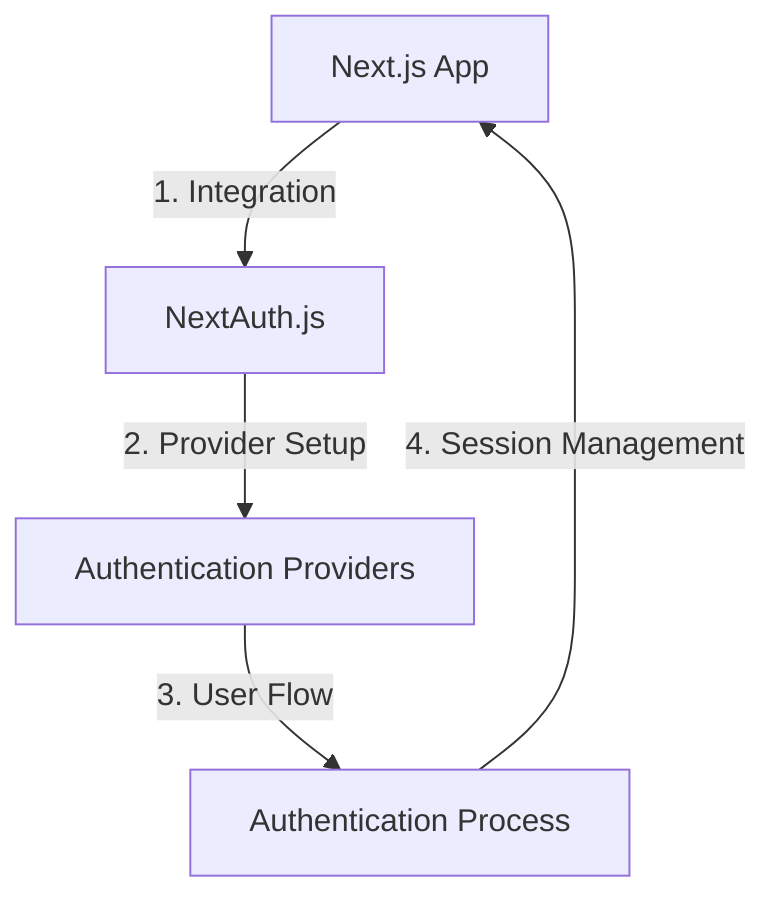
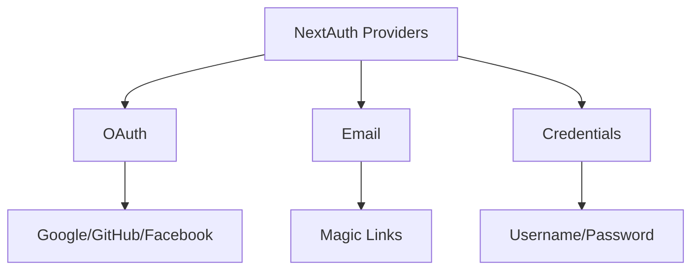

# 16.2.2 | NextAuth

# NextAuth.js: Complete Authentication Guide 🔐

## What is NextAuth.js? 
NextAuth.js is a powerful authentication solution designed specifically for Next.js applications, offering a comprehensive and flexible approach to handling user authentication.

## Core Features 🌟

### 1. Built-in Provider Support
```typescript
import NextAuth from 'next-auth'
import GithubProvider from 'next-auth/providers/github'

export default NextAuth({
  providers: [
    GithubProvider({
      clientId: process.env.GITHUB_ID,
      clientSecret: process.env.GITHUB_SECRET,
    }),
  ],
})
```

### 2. Key Benefits
- **Easy Integration** 🔌
  - Seamless setup with Next.js
  - Minimal boilerplate code
  - Built-in TypeScript support

- **Security First** 🛡️
  - CSRF protection
  - JWTs handling
  - Secure session management

- **Flexibility** 🔄
  - Multiple authentication providers
  - Custom authentication logic
  - Database agnostic

## Authentication Alternatives 🤔

### 1. External Providers

| Provider | Key Features | Best For |
|----------|-------------|-----------|
| Auth0 | Extensive identity features | Enterprise applications |
| Clerk | Modern UI components | Quick implementation |
| Firebase Auth | Google ecosystem | Mobile + Web apps |

### 2. In-house Cookie-based Auth
```javascript
// Basic cookie-based authentication
app.post('/login', (req, res) => {
  res.cookie('sessionId', 'user123', {
    httpOnly: true,
    secure: true,
    sameSite: 'strict'
  })
})
```

## Why Choose NextAuth? 💭

### Pros ✅
- Zero-dependency authentication
- Built-in security best practices
- Active community support
- Excellent documentation

### Cons ⚠️
- Learning curve for complex implementations
- Limited UI components out of the box
- Some advanced features require setup

## Best Practices 📋

1. **Environment Variables**
```env
NEXTAUTH_URL=http://localhost:3000
NEXTAUTH_SECRET=your_secure_secret
```

2. **Provider Configuration**
```typescript
// Recommended setup with multiple providers
export default NextAuth({
  providers: [
    GoogleProvider({...}),
    GitHubProvider({...}),
    EmailProvider({...}),
  ],
  callbacks: {
    async session({ session, token }) {
      return session
    }
  }
})
```

## Decision Making Guide 🎯

Consider NextAuth.js when you need:
- Rapid authentication implementation
- Multiple authentication providers
- Built-in security features
- Next.js specific optimizations

Consider alternatives when you need:
- Complex custom authentication flows
- Specific UI components
- Platform-specific features
- Complete control over auth implementation

---

> 💡 **Pro Tip**: Start with NextAuth.js for most Next.js projects unless you have specific requirements that necessitate an alternative solution.

# JWT + LocalStorage vs Next.js Authentication: A Detailed Comparison 🔄

## Express App Architecture (Traditional) 🏗️



### Authentication Flow 🔄
```javascript
// 1. User Login
const loginUser = async () => {
  const res = await fetch('/api/login', {
    method: 'POST',
    body: JSON.stringify(credentials)
  });
  
  // 2. Store JWT
  const { token } = await res.json();
  localStorage.setItem('token', token);
}

// 3. Make Authenticated Requests
const fetchData = async () => {
  const token = localStorage.getItem('token');
  const res = await fetch('/api/data', {
    headers: {
      'Authorization': `Bearer ${token}`
    }
  });
}
```

## Next.js App Architecture (Modern) 🌟



### Authentication Flow 🔄
```typescript
// 1. User Login (API Route)
export async function handler(req, res) {
  // Verify credentials
  const token = generateToken(user);
  
  // Set HTTP-only cookie
  res.setHeader('Set-Cookie', `token=${token}; HttpOnly`);
}

// 2. Protect Routes (Middleware)
export async function middleware(req) {
  const session = await getSession(req);
  if (!session) {
    return NextResponse.redirect('/login');
  }
}
```

## Head-to-Head Comparison 📊

| Feature | Express + LocalStorage | Next.js + Cookies |
|---------|----------------------|-------------------|
| **Security** | ❌ Vulnerable to XSS | ✅ XSS Protected |
| **Client Access** | ✅ Easy access | ❌ HTTP-Only |
| **Architecture** | Client-Server Split | Full-Stack Unified |
| **Setup Complexity** | 🟡 Moderate | 🟢 Simple |
| **Performance** | 🟡 Additional Headers | 🟢 Automatic |
| **Development** | 🟡 More Boilerplate | 🟢 Built-in Features |

## Why Next.js Approach is Better? 💪

### 1. Security Benefits
```typescript
// Next.js: Secure by Default
export default withIronSessionApiRoute(handler, {
  cookieName: "session",
  password: process.env.SECRET_KEY,
  cookieOptions: {
    secure: process.env.NODE_ENV === "production",
    httpOnly: true
  }
});
```

### 2. Development Experience
- 🚀 Built-in API routes
- 🛡️ Integrated middleware
- 📦 Session management
- 🔄 Server-side rendering support

### 3. Performance
```typescript
// No manual token management needed
import { useSession } from 'next-auth/react'

export default function Page() {
  const { data: session } = useSession()
  // Automatically protected!
}
```

## Best Practices & Recommendations 🎯

1. **For Next.js Apps**:
   - Use built-in authentication solutions
   - Leverage HTTP-only cookies
   - Implement middleware protection


2. **For Express Apps**:
   - Consider migrating to secure cookie-based auth
   - Implement proper JWT refresh mechanisms
   - Use secure storage alternatives


> 💡 **Pro Tip**: Always choose the authentication method that best aligns with your framework's architecture and security model.

# NextAuth.js: Complete Authentication Guide 🔒

## Core Functionality Overview 🌟



## Provider Integration Guide 🔌

### 1. Basic Setup
```typescript
// pages/api/auth/[...nextauth].ts
import NextAuth from 'next-auth'
import GoogleProvider from 'next-auth/providers/google'
import EmailProvider from 'next-auth/providers/email'

export default NextAuth({
  providers: [
    GoogleProvider({
      clientId: process.env.GOOGLE_ID,
      clientSecret: process.env.GOOGLE_SECRET,
    }),
    EmailProvider({
      server: process.env.EMAIL_SERVER,
      from: process.env.EMAIL_FROM,
    }),
  ],
})
```

### 2. Supported Authentication Methods 🛡️

| Provider Type | Examples | Setup Complexity |
|--------------|----------|------------------|
| Social Login | Google, GitHub, Facebook | 🟢 Easy |
| Email/Password | Magic Links, OTP | 🟡 Moderate |
| Custom | Database, Legacy Systems | 🔴 Complex |

## Implementation Guide 📚

### 1. Environment Setup
```env
# .env.local
NEXTAUTH_URL=http://localhost:3000
NEXTAUTH_SECRET=your_secret_key

# Provider Secrets
GOOGLE_ID=your_google_client_id
GOOGLE_SECRET=your_google_client_secret
```

### 2. Provider Configuration 🔧

#### Email Provider
```typescript
EmailProvider({
  server: {
    host: process.env.SMTP_HOST,
    port: process.env.SMTP_PORT,
    auth: {
      user: process.env.SMTP_USER,
      pass: process.env.SMTP_PASSWORD,
    },
  },
  from: 'noreply@example.com',
})
```

#### Social Providers
```typescript
FacebookProvider({
  clientId: process.env.FACEBOOK_ID,
  clientSecret: process.env.FACEBOOK_SECRET,
}),
```

## Session Management 🔄

### 1. Client-Side Usage
```typescript
// In your components
import { useSession, signIn, signOut } from 'next-auth/react'

export default function Component() {
  const { data: session } = useSession()

  if (session) {
    return (
      <>
        Signed in as {session.user.email}
        <button onClick={() => signOut()}>Sign out</button>
      </>
    )
  }
  return <button onClick={() => signIn()}>Sign in</button>
}
```

### 2. Server-Side Protection 🛡️
```typescript
// In getServerSideProps
export async function getServerSideProps(context) {
  const session = await getServerSession(context.req, context.res)

  if (!session) {
    return {
      redirect: {
        destination: '/auth/signin',
        permanent: false,
      },
    }
  }

  return {
    props: { session }
  }
}
```

## Security Features 🔐

1. **CSRF Protection**
   - Built-in token validation
   - Secure session handling

2. **OAuth Security**
   - State parameter validation
   - PKCE support
   - Secure token storage

3. **Session Security**
   ```typescript
   // Custom session configuration
   export default NextAuth({
     session: {
       strategy: 'jwt',
       maxAge: 30 * 24 * 60 * 60, // 30 days
       updateAge: 24 * 60 * 60, // 24 hours
     },
   })
   ```

> 💡 **Pro Tip**: Always implement proper error handling and loading states for a smooth authentication experience.

## Customization Options ⚙️

```typescript
export default NextAuth({
  theme: {
    colorScheme: 'dark',
    brandColor: '#3b82f6',
    logo: '/logo.png',
  },
  callbacks: {
    async jwt({ token, user }) {
      return { ...token, ...user }
    },
    async session({ session, token }) {
      session.user.role = token.role
      return session
    },
  },
})
```

# Catch-All Routes in Next.js 13+ 🌐

## Understanding Catch-All Routes 🎯

```mermaid
graph LR
    A[/api/auth/*] -->|Matches| B[/signin]
    A -->|Matches| C[/123]
    A -->|Matches| D[/random/path]
    A -->|Matches| E[Any Path...]
```

## Implementation Guide 📝

### 1. Project Setup
```bash
# Create new Next.js project
npx create-next-app@latest my-next-app
cd my-next-app
```

### 2. Creating Catch-All Route Handler 🛠️

```typescript
// app/api/auth/[...nextauth]/route.ts
import { NextRequest, NextResponse } from "next/server"

interface AuthParams {
    nextauth: string[]
}

export function GET(
    req: NextRequest, 
    { params }: { params: AuthParams }
) {
    console.log(params.nextauth) // Access path segments
    return NextResponse.json({
        message: "Auth Handler",
        path: params.nextauth
    })
}
```

## Route Matching Examples 🎯

| URL Pattern | Matched Path Array |
|-------------|-------------------|
| `/api/auth/signin` | `['signin']` |
| `/api/auth/123` | `['123']` |
| `/api/auth/random/path` | `['random', 'path']` |

### Testing Different Routes 🧪

```typescript
// Enhanced route handler with path logging
export function GET(
    req: NextRequest, 
    { params }: { params: AuthParams }
) {
    const pathSegments = params.nextauth
    const currentPath = pathSegments.join('/')
    
    console.log({
        segments: pathSegments,
        fullPath: currentPath
    })

    return NextResponse.json({
        message: "Auth Handler",
        path: currentPath,
        segments: pathSegments
    })
}
```

## Advanced Usage 🚀

### 1. Path-Based Logic
```typescript
export function GET(req: NextRequest, { params }: { params: AuthParams }) {
    const [action, ...rest] = params.nextauth

    switch(action) {
        case 'signin':
            return handleSignIn()
        case 'signout':
            return handleSignOut()
        default:
            return handleDefault(rest)
    }
}
```

### 2. Dynamic Response Handling
```typescript
function handleRoute(segments: string[]) {
    return NextResponse.json({
        action: segments[0],
        subPath: segments.slice(1),
        timestamp: new Date().toISOString()
    })
}
```

## Best Practices 💡

1. **Path Validation**
   ```typescript
   if (!params.nextauth?.length) {
       return NextResponse.json(
           { error: "Invalid path" },
           { status: 400 }
       )
   }
   ```

2. **Type Safety**
   ```typescript
   type AuthAction = 'signin' | 'signout' | 'callback'
   
   function isValidAction(action: string): action is AuthAction {
       return ['signin', 'signout', 'callback'].includes(action)
   }
   ```

3. **Error Handling**
   ```typescript
   try {
       const [action] = params.nextauth
       if (!isValidAction(action)) {
           throw new Error('Invalid auth action')
       }
       // Handle route
   } catch (error) {
       return NextResponse.json(
           { error: error.message },
           { status: 400 }
       )
   }
   ```

> 🔍 **Pro Tip**: Use catch-all routes when you need to handle multiple related endpoints under a common path structure.

# Setting Up NextAuth Catch-All Route in Next.js 🔒

## Initial Project Setup 🚀

### 1. Install Dependencies
```bash
# Install NextAuth.js in your project
npm install next-auth
```

### 2. Create Auth Route Structure 📁

```plaintext
app/
└── api/
    └── auth/
        └── [...nextauth]/
            └── route.ts
```

## Basic Route Configuration ⚙️

### 1. Create Basic Handler
```typescript
// app/api/auth/[...nextauth]/route.ts
import NextAuth from "next-auth"
import type { AuthOptions } from "next-auth"

export const authOptions: AuthOptions = {
    providers: [], // We'll add providers later
    secret: process.env.NEXTAUTH_SECRET
}

const handler = NextAuth(authOptions)

export { handler as GET, handler as POST }
```

### 2. Environment Setup
```env
# .env.local
NEXTAUTH_SECRET=your_secure_secret_key
NEXTAUTH_URL=http://localhost:3000
```

## Provider Categories 🔍



## Provider Implementation Guide 📋

### 1. OAuth Provider (Google Example)
```typescript
import GoogleProvider from "next-auth/providers/google"

export const authOptions: AuthOptions = {
    providers: [
        GoogleProvider({
            clientId: process.env.GOOGLE_ID!,
            clientSecret: process.env.GOOGLE_SECRET!,
        }),
    ],
}
```

### 2. Email Provider (Passwordless)
```typescript
import EmailProvider from "next-auth/providers/email"

export const authOptions: AuthOptions = {
    providers: [
        EmailProvider({
            server: process.env.EMAIL_SERVER,
            from: process.env.EMAIL_FROM,
        }),
    ],
}
```

### 3. Credentials Provider
```typescript
import CredentialsProvider from "next-auth/providers/credentials"

export const authOptions: AuthOptions = {
    providers: [
        CredentialsProvider({
            name: "Credentials",
            credentials: {
                username: { label: "Username", type: "text" },
                password: { label: "Password", type: "password" }
            },
            async authorize(credentials) {
                // Add your authentication logic here
                return null
            }
        }),
    ],
}
```

## Provider Comparison 📊

| Provider Type | Authentication Method | Use Case | Setup Complexity |
|--------------|----------------------|-----------|------------------|
| OAuth | Social Login | Quick Integration | 🟡 Medium |
| Email | Magic Links | Passwordless Auth | 🟢 Easy |
| Credentials | Custom Auth | Full Control | 🔴 Complex |

## Route Handling 🛣️

### How NextAuth Routes Work
```plaintext
/api/auth/signin  → Sign-in page
/api/auth/signout → Sign-out page
/api/auth/session → Session data
/api/auth/csrf    → CSRF token
```

### Route Mapping
```typescript
// app/api/auth/[...nextauth]/route.ts
export const authOptions: AuthOptions = {
    pages: {
        signIn: '/custom/signin',
        signOut: '/custom/signout',
        error: '/custom/error',
    }
}
```

> 💡 **Pro Tip**: The `[...nextauth]` catch-all route handles all auth-related requests automatically. No need to create separate route handlers!


# Next.js Authentication Guide with NextAuth.js 🔐

## Overview
This guide demonstrates how to implement authentication in Next.js using NextAuth.js, with a focus on credentials-based authentication.

## Setup Instructions 🛠️

### 1. Create Credentials Provider
Create a new authentication handler in `app/api/auth/[...nextauth]/route.ts`:

```typescript
import NextAuth from "next-auth"
import CredentialsProvider from 'next-auth/providers/credentials';

const handler = NextAuth({
  providers: [
    CredentialsProvider({
      name: 'Credentials',
      credentials: {
        username: { label: 'email', type: 'text', placeholder: '' },
        password: { label: 'password', type: 'password', placeholder: '' },
      },
      async authorize(credentials: any) {
        return {
          id: "user1"
        };
      },
    })
  ],
  secret: process.env.NEXTAUTH_SECRET
})

export { handler as GET, handler as POST }
```

### 2. Environment Configuration ⚙️
Add to your `.env` file:

```plaintext
NEXTAUTH_URL=http://localhost:3000
NEXTAUTH_SECRET=password_nextauth
```

### 3. UI Components Setup 🎨

#### Create Authentication AppBar
```typescript
"use client";
import { signIn, signOut } from "next-auth/react"

export const Appbar = () => {
  return <div>
    <button onClick={() => signIn()}>Signin</button>
    <button onClick={() => signOut()}>Sign out</button>
  </div>
}
```

#### Setup Authentication Provider
Create `providers.tsx`:

```typescript
'use client';
import React from 'react';
import { SessionProvider } from 'next-auth/react';

export const Providers = ({ children }: { children: React.ReactNode }) => {
  return (
    <SessionProvider>
      {children}
    </SessionProvider>
  );
};
```

### 4. Root Layout Integration 🌳
Update your `layout.tsx`:

```typescript
import { Providers } from "./provider";

export default function RootLayout({
  children,
}: Readonly<{
  children: React.ReactNode;
}>) {
  return (
    <html lang="en">
      <body className={inter.className}>
        <Providers>
          {children}
        </Providers>
      </body>
    </html>
  );
}
```

## Authentication Methods 🔑

### Client-Side Authentication
```typescript
"use client"
import { useSession } from "next-auth/react";

export default function Home() {
  const session = useSession();
  return (
    <div>
      {JSON.stringify(session.data?.user)}
    </div>
  );
}
```

### Server-Side Authentication
```typescript
import { getServerSession } from "next-auth"

async function getUser() {
  const session = await getServerSession();
  return session;
}

export default async function Home() {
  const session = await getUser();
  return (
    <div>
      {JSON.stringify(session?.user?.name)}
    </div>
  );
}
```

### API Route Authentication
Create `/api/user` route:

```typescript
import { getServerSession } from "next-auth"
import { NextResponse } from "next/server";

export async function GET() {
  const session = await getServerSession();
  return NextResponse.json({
    name: session?.user?.name
  })
}
```

## Advanced Configuration 🔧

### Enhanced User Data Persistence
Configure callbacks in your auth configuration:

```typescript
{
  callbacks: {
    jwt: async ({ user, token }: any) => {
      if (user) {
        token.uid = user.id;
      }
      return token;
    },
    session: ({ session, token, user }: any) => {
      if (session.user) {
        session.user.id = token.uid
      }
      return session
    }
  }
}
```

### Modular Authentication Configuration
Create `lib/auth.ts`:

```typescript
import CredentialsProvider from 'next-auth/providers/credentials';

export const NEXT_AUTH_CONFIG = {
  providers: [
    CredentialsProvider({
      // ... provider configuration
    })
  ],
  secret: process.env.NEXTAUTH_SECRET,
  callbacks: {
    // ... callback configuration
  }
}
```

## Reference Links 📚
- Complete implementation: [GitHub Repository](https://github.com/100xdevs-cohort-2/week-16-auth-2)
- NextAuth.js Documentation: [Callbacks](https://next-auth.js.org/configuration/callbacks)
- Example Implementation: [NextAuth.js Examples](https://next-auth.js.org/getting-started/example)

# Adding Google OAuth Provider to NextAuth.js 🔐

## Prerequisites
- A Google Cloud Console account
- Next.js project with NextAuth.js installed
- Basic understanding of OAuth 2.0

## Setup Instructions 🛠️

### 1. Google Cloud Console Configuration
1. Go to [Google Cloud Console](https://console.cloud.google.com)
2. Create a new project or select existing one
3. Enable OAuth consent screen
4. Create OAuth 2.0 credentials

```bash
# Required OAuth 2.0 redirect URI format
http://localhost:3000/api/auth/callback/google  # Development
https://your-domain.com/api/auth/callback/google  # Production
```

### 2. Environment Variables ⚙️
Add these to your `.env` file:

```env
GOOGLE_CLIENT_ID=your_client_id_here
GOOGLE_CLIENT_SECRET=your_client_secret_here
```

### 3. Provider Configuration 🔧

#### Update Auth Configuration
```typescript
import NextAuth from "next-auth"
import GoogleProvider from "next-auth/providers/google"

const handler = NextAuth({
  providers: [
    GoogleProvider({
      clientId: process.env.GOOGLE_CLIENT_ID!,
      clientSecret: process.env.GOOGLE_CLIENT_SECRET!,
    }),
    // ... other providers
  ],
  // ... other configuration
})

export { handler as GET, handler as POST }
```

#### Modular Configuration (lib/auth.ts)
```typescript
import GoogleProvider from "next-auth/providers/google"
import CredentialsProvider from 'next-auth/providers/credentials'

export const NEXT_AUTH_CONFIG = {
  providers: [
    GoogleProvider({
      clientId: process.env.GOOGLE_CLIENT_ID!,
      clientSecret: process.env.GOOGLE_CLIENT_SECRET!,
    }),
    CredentialsProvider({
      // ... existing credentials provider
    }),
  ],
  callbacks: {
    // ... existing callbacks
  },
}
```

## Accessing Google Profile Data 📝

### Available Profile Information
```typescript
interface GoogleProfile {
  email: string
  email_verified: boolean
  name: string
  picture: string
  given_name: string
  family_name: string
  locale: string
  sub: string  // Google's unique identifier
}
```

### Customizing Profile Data
```typescript
{
  callbacks: {
    async jwt({ token, account, profile }) {
      if (account?.provider === "google") {
        token.googleId = profile.sub
        token.picture = profile.picture
      }
      return token
    },
    async session({ session, token }) {
      if (session.user) {
        session.user.googleId = token.googleId
        session.user.image = token.picture
      }
      return session
    }
  }
}
```

## Error Handling 🚨

```typescript
{
  callbacks: {
    async signIn({ account, profile }) {
      if (account.provider === "google") {
        return profile.email_verified && 
               profile.email.endsWith("@yourdomain.com")
      }
      return true
    }
  }
}
```

## Additional Configuration Options 🎛️

### Requesting Extra Scopes
```typescript
GoogleProvider({
  clientId: process.env.GOOGLE_CLIENT_ID!,
  clientSecret: process.env.GOOGLE_CLIENT_SECRET!,
  authorization: {
    params: {
      scope: "openid email profile https://www.googleapis.com/auth/calendar"
    }
  }
})
```

### State Parameters
```typescript
GoogleProvider({
  clientId: process.env.GOOGLE_CLIENT_ID!,
  clientSecret: process.env.GOOGLE_CLIENT_SECRET!,
  authorization: {
    params: {
      prompt: "consent",
      access_type: "offline",
      response_type: "code"
    }
  }
})
```

## Security Best Practices 🔒

1. **Environment Variables**
   - Never commit credentials to version control
   - Use different OAuth credentials for development/production

2. **Scope Management**
   - Request minimum required scopes
   - Document scope usage in your privacy policy

3. **Token Storage**
   - Use secure session storage
   - Implement proper token rotation

## Testing 🧪

```typescript
describe('Google Authentication', () => {
  it('should successfully authenticate with valid credentials', async () => {
    const mockGoogleProfile = {
      email: 'test@example.com',
      email_verified: true,
      // ... other profile data
    }
    // Test implementation
  })
})
```

## Common Issues and Solutions 💡

| Issue | Solution |
|-------|----------|
| Invalid redirect URI | Double-check OAuth configuration in Google Console |
| Token expired | Implement proper token refresh logic |
| Scope permission denied | Review requested scopes and user consent |

---

For more detailed information, refer to:
- [NextAuth.js Google Provider Documentation](https://next-auth.js.org/providers/google)
- [Google OAuth 2.0 Documentation](https://developers.google.com/identity/protocols/oauth2)